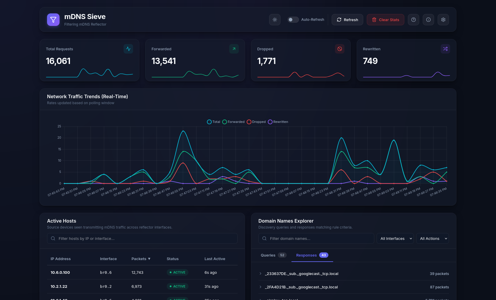
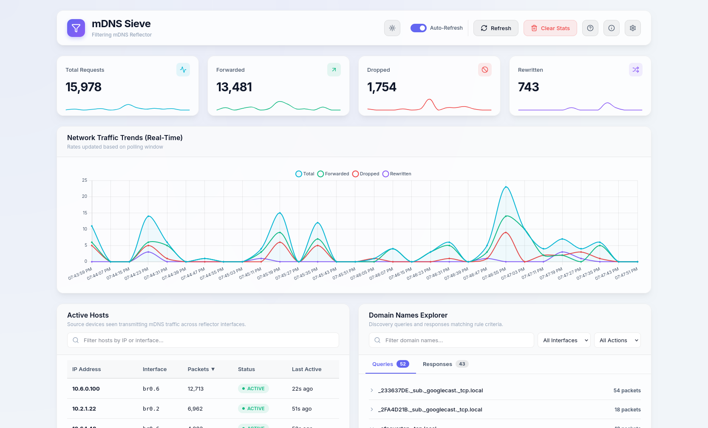
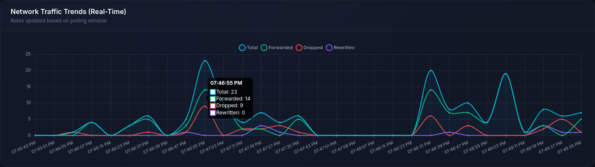
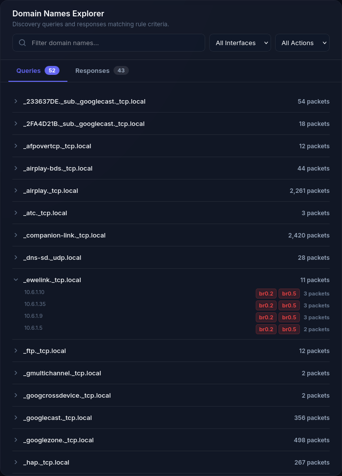
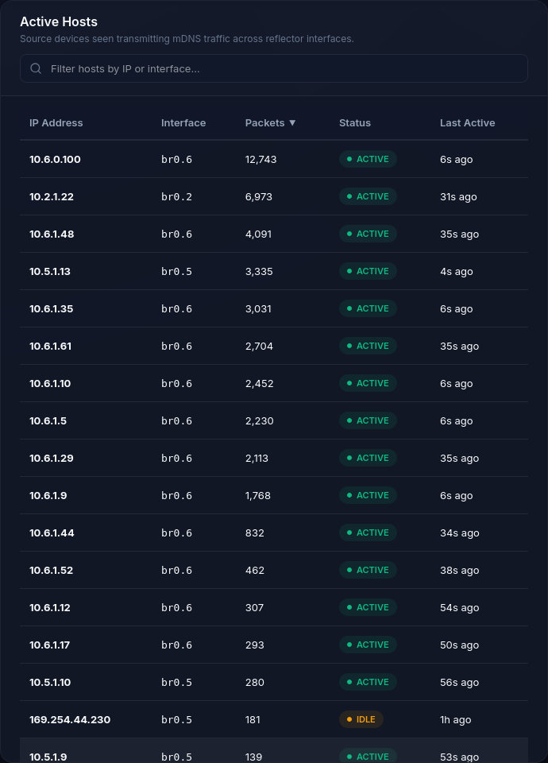
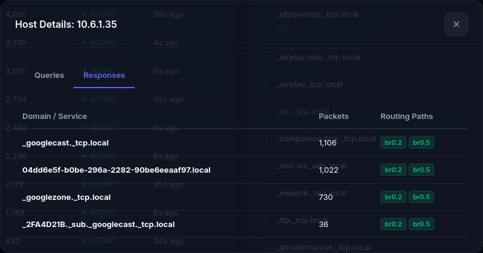

# mdns-sieve

`mdns-sieve` is a lightweight Multicast DNS (mDNS) reflector and filtering daemon. It forwards mDNS queries and responses across multiple isolated network interfaces (subnets/VLANs) using glob-style rules to control which services and hostnames are visible across zones.

Designed for low-end hardware and resource-constrained environments (like OpenWrt routers and Raspberry Pis), the codebase is self-recovering and dependency-free.

---

## Why Deploy `mdns-sieve` on Your Network?

Traditional mDNS reflectors (like Avahi's reflector mode or `mdns-repeater`) operate as mirrors that repeat all mDNS packets across all interfaces. In segmented network environments containing IoT devices, this introduces security and performance issues.

`mdns-sieve` addresses these concerns by providing:

### 1. Prevention of Network Reconnaissance (Scanning)
A compromised IoT device (such as a smart plug, IP camera, or smart TV) can be used to scan the network using mDNS queries.
* **Without Filtering:** A query looking for servers, workstations, or file shares is reflected to other networks. Personal computers and NAS devices respond, providing a map of local devices and IPs.
* **With mdns-sieve:** You can define rules that prevent mDNS queries originating from the IoT network from reaching other interfaces.

### 2. Mitigation of Service Spoofing and Cache Poisoning
mDNS is unauthenticated, meaning clients trust any response they hear on the network.
* **Without Filtering:** A device on the IoT VLAN can broadcast responses claiming to be a local network printer or file share. Laptops on other VLANs may route print jobs or credentials to the device.
* **With mdns-sieve:** Unsolicited advertisements/answers from the IoT network are blocked from entering other zones unless explicitly allowed.

### 3. Reduced Attack Surface on Local Devices
Many operating systems run background services that respond to mDNS queries. Blocking incoming queries from other segments prevents local machines from leaking their presence or service versions.

### 4. Reduced Wi-Fi Multicast Noise
IoT devices often broadcast state advertisements. Since multicast Wi-Fi frames are transmitted at slow baseline rates, this consumes airtime. Blocking these unsolicited packets at the reflector prevents them from flooding the Wi-Fi, reducing CPU usage on connected devices.

---

## Quick Start (Python Version)

### 1. Build the wheel(s)
```bash
pip wheel --no-deps -w dist py
pip wheel --no-deps -w dist py-gui # optional web dashboard
```

This will produce to Python wheels in the `dist` directory. Transfer them to the system on which to want to run the program.

### 2. Install the Wheels
```bash
python3 -m venv /path/to/venv
/path/to/venv/bin/pip install -f dist/ mdns-sieve
/path/to/venv/bin/pip install -f dist/ mdns-sieve-gui  # optional
```

A separate virtual environment is not required but is highly recommended when using the `setcap` command to allow the daemon to listen for mDNS packets. See below.

### 3. Configure mdns-sieve
Create a `config.yaml` file to define your active interfaces, rules, tracking options, and command server options. Example:
```yaml
interfaces:
  - eth0   # Trusted LAN
  - wlan0  # IoT Wi-Fi

default_action: drop
rewrite_mixed_packets: true
forward_known_answers: false

rules:
  # Forward Trusted devices casting to IoT Chromecast
  - action: forward
    services:
      - "_googlecast._tcp.local"
    src: "*"
    dst: "*"

# Database persistence for tracking packets
tracking:
  enabled: true
  db_path: "/var/lib/mdns-sieve/responses.db"
  flush_interval_seconds: 5
  retention_days: 7

# Control server for GUI dashboard connection
command_server:
  enabled: true
  host: "127.0.0.1"
  port: 5354
```

### 4. Run the Daemon
The daemon requires the `CAP_NET_RAW` capability to bind sockets to specific network interfaces using `SO_BINDTODEVICE`.

You can grant this capability to the virtual environment's Python binary using `setcap` to run the daemon without root privileges:
```bash
# Warning: do not do this for your system Python executable (/usr/bin/python) or for shared virtual environments.
sudo setcap cap_net_raw+ep /path/to/venv/bin/python3
/path/to/venv/bin/mdns-sieve --config config.yaml [-v[v]]
```

Alternatively, you can run the daemon directly using `sudo`:
```bash
sudo /path/to/venv/bin/mdns-sieve --config config.yaml [-v[v]]
```
* Use `-v` to log dropped packets.
* Use `-vv` to log both dropped packets and successfully forwarded packets.


### 5. (Optional) Run the Web GUI
Start the GUI server:
```bash
/path/to/venv/bin/mdns-sieve-gui --daemon-host 127.0.0.1 --daemon-port 5354 --port 8080
```
Open `http://your_server:8080` in your browser to access the dashboard.

---

## Web Dashboard

`mdns-sieve` provides a responsive web interface to inspect network activity.

### Dark and Light Mode Dashboard Overviews

| Dark Theme Overview | Light Theme Overview |
| :---: | :---: |
|  |  |

### Features

#### Network Traffic Graph
Displays trend lines showing forwarded, dropped, and rewritten packets.


#### Telemetry & SQLite Persistence

When tracking is enabled, the daemon persists traffic metrics to an SQLite database (default: `/var/lib/mdns-sieve/responses.db`).
* **In-Memory Buffering**: The system records metrics in-memory first to minimize disk writes, periodically flushing batch queries and responses.
* **Automated Pruning**: Telemetry history is pruned based on a configurable `retention_days` limit to prevent database growth.
* **Shutdown Handling**: Catches termination signals (`SIGINT` and `SIGTERM`) to flush all pending memory buffers to disk before exiting.

#### Domain Names Explorer
Groups mDNS records by service type and source IP. Supports regex/text queries, action selectors (Forwarded/Dropped), and interface filters. Service names are middle-ellipsized, with hover tooltips and a copy button supporting HTTP secure context fallback.


#### Active Hosts
Lists active source IPs on network interfaces with sparklines showing packet activity.


#### Host Details & Flex Modals
Consolidation of nested scrollbars inside modal bodies for viewport adjustments and host statistics.


#### Stats Reset & Database Purging
GUI controls allowing users to reset dashboard counters and purge SQLite tracking history.

---

## Project Structure

This repository is organized as follows:
* `py/` — Python 3.10+ package.
  * `src/mdns_sieve/mdns_parser.py` — Custom binary mDNS parser with recursion pointer protection.
  * `src/mdns_sieve/config.py` — YAML configuration rule validation and matching engine.
  * `src/mdns_sieve/reflector.py` — Linux `SO_BINDTODEVICE` isolated sockets and recovery event loop.
  * `src/mdns_sieve/database.py` — SQLite DatabaseManager for metrics persistence and automated pruning.
  * `src/mdns_sieve/command_server.py` — TCP API command server providing stats, hosts activity, and domain metrics.
  * `src/mdns_sieve/main.py` — CLI entrypoint, logging levels, and signal handling.
  * `tests/` — Mock-based unit and integration test suite.
* `py-gui/` — Dashboard Web GUI and HTTP control server (Python 3.10+).
  * `src/mdns_sieve_gui/main.py` — HTTP dashboard server and proxy handler to the backend reflector TCP socket.
  * `src/mdns_sieve_gui/static/` — Static HTML, CSS (Vanilla CSS dark/light mode), and Javascript (Vanilla JS with Sparkline graphs and Lucide icons).
  * `tests/` — Integration and unit test suite for the dashboard.
